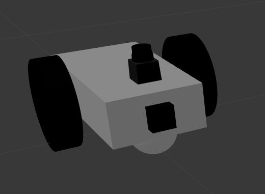

# Go-Chase-It Robotics Project

This project implements ROS, Gazebo, and RViz to create a simulation of a robot in an environment. The robot is able to drive around in the simulated environment, and follow a white ball placed in the environment with it by utilizing simulated sensors. This project number two of the Udacity Robotics Software Engineer Nanodegree program.  


## The Simulation

#### The Environment

Using the Gazebo simulation tool associated with ROS, the robot and environment was created. The environment was reused from a previous project done for this Nanodegree, [Gazebo Project](https://github.com/808brick/Gazebo_Workspace). These associated environment files can be found in the `my_robot` package, under the `worlds` and `model` folders.

#### The Robot

The robot in this simulation is a simple box-like chasis, equipped with 2 wheels on either side, spherical casters in the front and back, a front camera, and a hokuyo lidar on top. The associated robot files can be found in the `my_robot` package. The main simulation file which details the robot in the simulation is in the `urdf` folder, in the `my_robot.xacro` file. This details all the physical structure of the robot, and the associated joints which connects the various parts.



The associated Gazebo and RViz related components to simulate the sensors can be found in the `urdf` folder in `my_robot.gazebo`. This includes the differential drive controller to drive the robot by publishing twist ROS topics. IT also references the camera and lidar functionality.  


## Ball Chaser Node

#### Creating A ROS Service
A custom ROS service definition is used in this project to take in a forward and angular velocity, and publish it accordingly to the differential drive controller. The service definition is in the `ball_chaser/srv/DriveToTarget.srv`. The `CMakeLists.txt` in the `ball_chaser` package is modified to incorporate this custom service definition.

#### Following The White Ball
The code used for following the white ball is done in C++ in `ball_chaser/src/process_image.cpp`. It takes in image data from the robot's front camera, and looks for pure white pixels, since the ball in the simulation is the only thing that is purely white. It breaks the image matrix into 3 sections (left, middle, right), and counts how many white pixels it detects in each section. It then either drives forward and/or turns in a corresponding direction to drive towards the ball by sending requests to the `DriveToTarget` service, giving it a forward and angular velocity to drive at.


## Running The Project

Make a catkin workspace if you do not have one already. Then clone this repository contents into the source folder. Note these instructions are intended for users running Ubuntu with ROS already installed.

```bash
mkdir -p catkin_ws/src/
cd catkin_ws/src/
```

Now compile the code, and source it.

```bash
cd catkin_ws/
catkin_make
source devel/setup.bash
```
Now that you have compiled and sourced the packages, launch the simulation and the ball_chaser node.


```bash
roslaunch myrobot world.launch
roslaunch ball_chaser ball_chaser.launch
```
Gazebo and RViz should open. RViz will be configured to include the image stream and laser scan data, as shown in the GIF at the top of this doument. 
